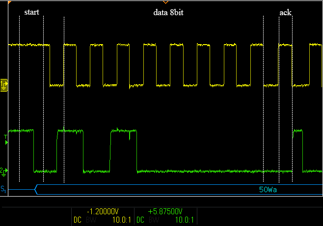
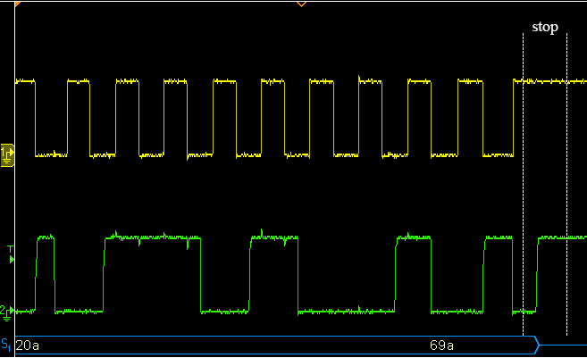
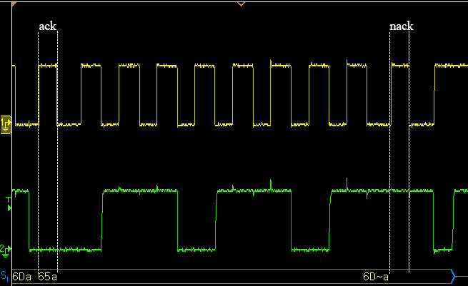

# Driver_bus_i2c
### *Usage*

#### Step 1 ：User add I2C bus port function

```c
/**
 * @brief Software i2c bus port (master mode)
 */
typedef struct
{
    void (*holdtime)(void);
    void (*sda_mode)(IO_MODE mode);
    void (*scl_mode)(IO_MODE mode);
    void (*set_scl)(uint8_t level);
    void (*set_sda)(uint8_t level);
    uint8_t(*get_sda)(void);
} sw_i2c_t;

/**
 * @brief Hardware i2c bus port (master mode)
 */
typedef struct
{
    uint8_t(*send)(uint16_t devaddr, uint8_t *pdata, uint32_t size);
    uint8_t(*recv)(uint16_t devaddr, uint8_t *pdata, uint32_t size);
    uint8_t(*wmem)(uint16_t devaddr, uint16_t memaddr, uint8_t memaddrsize, uint8_t *pdata, uint32_t size);
    uint8_t(*rmem)(uint16_t devaddr, uint16_t memaddr, uint8_t memaddrsize, uint8_t *pdata, uint32_t size);
} hw_i2c_t;
```

#### Step 2 ：Init I2C bus Device （Mounted Devices）

```c
/* I2C Bus (Mounted Devices) */
void bus_delay(uint8_t mult)
{
    uint8_t i;

    for (i = 0; i < mult; i++)
    {
        /*---------------- delay ---------------- */
        uint16_t i = 50;
        do
        {
            __NOP();
        } while (i--);
        /*--------------------------------------- */
    }
}
void set_SCL(uint8_t level)
{
if (level)
{
    /*---------- Set pin high level ----------*/
    HAL_GPIO_WritePin(AT24C02_SCL_GPIO_Port, AT24C02_SCL_Pin, GPIO_PIN_SET);
    /*--------------------------------------- */
}
else
{
    /*---------- Set pin low level ----------*/
    HAL_GPIO_WritePin(AT24C02_SCL_GPIO_Port, AT24C02_SCL_Pin, GPIO_PIN_RESET);
    /*--------------------------------------- */
}
}
void set_SDA(uint8_t level)
{
    if (level)
    {
        /*---------- Set pin high level ----------*/
        HAL_GPIO_WritePin(AT24C02_SDA_GPIO_Port, AT24C02_SDA_Pin, GPIO_PIN_SET);
        /*--------------------------------------- */
    }
    else
    {
        /*---------- Set pin low level ----------*/
        HAL_GPIO_WritePin(AT24C02_SDA_GPIO_Port, AT24C02_SDA_Pin, GPIO_PIN_RESET);
        /*--------------------------------------- */
    }
}
uint8_t get_SDA(void)
{
    uint8_t ret = 0;

    /*--------------- read pin ---------------*/
    ret = HAL_GPIO_ReadPin(AT24C02_SDA_GPIO_Port, AT24C02_SDA_Pin);
    /*--------------------------------------- */

    return ret;
}
void mode_SDA(IO_MODE mode)
{
    static uint8_t firsttime = 0;
    
    if (firsttime == 0)
    {
        GPIO_InitTypeDef GPIO_InitStruct = { 0 };
        GPIO_InitStruct.Pin = AT24C02_SDA_Pin;
        GPIO_InitStruct.Mode = GPIO_MODE_OUTPUT_OD;
        GPIO_InitStruct.Pull = GPIO_NOPULL;
        GPIO_InitStruct.Speed = GPIO_SPEED_FREQ_LOW;
        HAL_GPIO_Init(GPIOH, &GPIO_InitStruct);
        firsttime++;
    }
    if (mode == IO_IN)
    {
        /*--------------- Set to input mode ---------------*/
        HAL_GPIO_WritePin(AT24C02_SDA_GPIO_Port, AT24C02_SDA_Pin, GPIO_PIN_SET);
        /*------------------------------------------------ */
    }
    else
    {
        /*--------------- Set to output mode --------------*/
        /*------------------------------------------------ */
    }
}
void mode_SCL(IO_MODE mode)
{
if (mode == IO_IN)
{
    /*--------------- Set to input mode ---------------*/
    GPIO_InitTypeDef GPIO_InitStruct = { 0 };
    GPIO_InitStruct.Pin = AT24C02_SCL_Pin;
    GPIO_InitStruct.Mode = GPIO_MODE_INPUT;
    GPIO_InitStruct.Pull = GPIO_PULLUP;
    GPIO_InitStruct.Speed = GPIO_SPEED_FREQ_LOW;
    HAL_GPIO_Init(GPIOH, &GPIO_InitStruct);
    /*------------------------------------------------ */
}
else
{
    /*--------------- Set to output mode --------------*/
    GPIO_InitTypeDef GPIO_InitStruct = { 0 };
    GPIO_InitStruct.Pin = AT24C02_SCL_Pin;
    GPIO_InitStruct.Mode = GPIO_MODE_OUTPUT_PP;
    GPIO_InitStruct.Pull = GPIO_PULLUP;
    GPIO_InitStruct.Speed = GPIO_SPEED_FREQ_LOW;
    HAL_GPIO_Init(GPIOH, &GPIO_InitStruct);
    /*------------------------------------------------ */
}
}

sw_i2c_t sw_i2c;
sw_i2c.set_scl = set_SCL;
sw_i2c.scl_mode = mode_SCL;
sw_i2c.set_sda = set_SDA;
sw_i2c.get_sda = get_SDA;
sw_i2c.sda_mode = mode_SDA;
sw_i2c.holdtime = bus_delay;
i2c_config(&sw_i2c);

```


### *Actual waveform*







